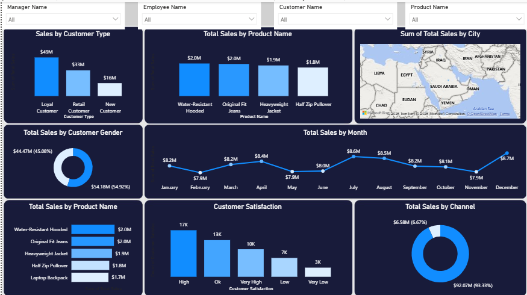

# Sales-Performance-Dashboard
## 📊 Overview

This project presents an interactive **Sales Performance Dashboard** designed to analyze sales performance, customer behavior, product performance, and customer satisfaction.

The dashboard provides a clear overview of key sales metrics and allows users to explore the data using interactive filters such as **Manager Name, Employee Name, Customer Name, and Product Name**.

## 🎯 Dashboard Objectives

The main objectives of this dashboard are to:

* Analyze total sales across different customer types.
* Identify the best-performing products.
* Analyze sales performance by month.
* Understand customer demographics and gender distribution.
* Evaluate customer satisfaction levels.
* Compare sales across different sales channels.
* Analyze the geographical distribution of sales.

## 📈 Dashboard Insights

The dashboard includes the following visualizations:

### Sales by Customer Type

Compares sales generated from:

* Loyal Customers
* Retail Customers
* New Customers

### Total Sales by Product

Shows the highest-performing products based on total sales.

### Sales by City

Provides a geographical view of sales distribution across different cities.

### Sales by Customer Gender

Displays the percentage distribution of sales between male and female customers.

### Total Sales by Month

Tracks monthly sales performance and highlights changes and trends throughout the year.

### Customer Satisfaction

Analyzes customers based on their satisfaction level:

* High
* OK
* Very High
* Low
* Very Low

### Sales by Channel

Compares sales generated through different sales channels.

## 🔎 Interactive Filters

Users can interact with the dashboard using:

* Manager Name
* Employee Name
* Customer Name
* Product Name

These filters make it easier to drill down into specific sales and customer segments.

## 🛠️ Tools & Technologies

* **Microsoft Power BI**
* Data Visualization
* Business Intelligence
* Interactive Dashboards
* Data Analysis

## 📊 Key Metrics

The dashboard provides insights into:

* Total Sales
* Sales by Customer Type
* Sales by Product
* Monthly Sales
* Sales by City
* Sales by Gender
* Customer Satisfaction
* Sales by Channel

## 🖼️ Dashboard Preview

## 💡 Key Takeaways

The dashboard helps decision-makers quickly identify:

* Which customer segments generate the most revenue.
* Which products have the highest sales.
* Monthly sales trends and performance changes.
* Customer satisfaction levels.
* The most important sales channels.
* Geographic areas contributing to sales.

## 🚀 Project Purpose

This project was created as a **Business Intelligence and Data Analytics portfolio project** to demonstrate the ability to transform sales data into an interactive and easy-to-understand dashboard.

It focuses on presenting business data in a way that can support **data-driven decision-making**.

## 👤 Author

**Mohamed Hassan**

GitHub: [Mohamed Hassan](https://github.com/mohamedhassan63364-rgb)
